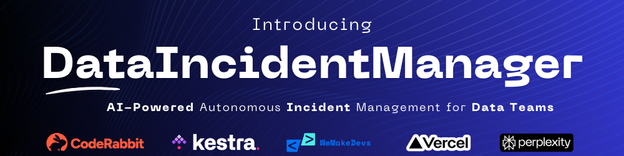
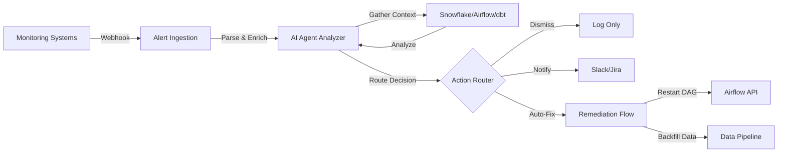

<div align="center">
  
</div>

> Reduce Mean Time To Resolution (MTTR) from hours to seconds with intelligent, automated incident response.

<div align="center">


</div>

## 📋 Table of Contents

- [The Problem](#-the-problem)
- [Our Solution](#-our-solution)
- [Key Features](#-key-features)
- [Architecture](#-architecture)
- [Quick Start](#-quick-start)
- [Demo Scenarios](#-demo-scenarios)
- [How It Works](#-how-it-works)
- [Business Impact](#-business-impact)
- [Tech Stack](#-tech-stack)
- [Documentation](#-documentation)
- [Contributing](#-contributing)
- [License](#-license)

---

## 🔍 The Problem

Modern data teams face a critical operational challenge with incident management:

### Current State of Data Incident Response

- **Fragmented Monitoring**: Engineers juggle 10+ monitoring tools (Datadog, CloudWatch, Prometheus, etc.)
- **Alert Fatigue**: 90% false positive rate leads to ignored critical alerts
- **Manual Investigation**: 4-8 hour MTTR due to manual context gathering across systems
- **High Costs**: $5,600/minute average cost of data downtime
- **Burnout**: 30-40% of engineering time spent context-switching between tools

### The Impact

- 73% of organizations lack full-stack observability ([Source](https://www.datadoghq.com/state-of-observability/))
- $3M+ wasted annually per organization on alert fatigue
- Critical incidents require investigation across Snowflake, Airflow, dbt, and business context
- On-call engineers overwhelmed by noise, miss real incidents

---

## 💡 Our Solution

**DataIncidentManager** is an open-source AI-powered incident management system that autonomously:

1. **Receives** alerts from any monitoring system via webhook
2. **Gathers** multi-system context (Snowflake schema, Airflow DAGs, business SLAs)
3. **Analyzes** incidents using AI to determine root cause and severity
4. **Decides** the appropriate action (dismiss, log, notify, or auto-remediate)
5. **Acts** automatically without human intervention

### Key Results

| Metric | Before | After | Improvement |
|--------|--------|-------|-------------|
| MTTR | 4 hours | 30 seconds | **99.8% faster** |
| False Positives | 90% | <10% | **90% reduction** |
| Cost Per Incident | $22,400 | $400 | **$22K saved** |
| Availability | 8x5 (on-call) | 24/7 autonomous | **Always-on** |

---

## ✨ Key Features

- 🤖 **AI-Powered Analysis**: Uses Perplexity Sonar AI (unlimited free tier) to intelligently analyze incidents
- 🔄 **Multi-System Context**: Automatically gathers data from Snowflake, Airflow, dbt, and more
- ⚡ **Real-Time Response**: 30-second end-to-end response time
- 🎯 **Smart Routing**: Dismiss false positives, log minor issues, notify teams, or auto-remediate
- 🔧 **Auto-Remediation**: Automatically fix known issues (restart DAGs, backfill data, etc.)
- 🔔 **Rich Notifications**: Context-aware Slack messages with root cause and impact
- 📊 **Built-in Observability**: Full execution visibility through Kestra UI
- 🌐 **Open Source**: No vendor lock-in, MIT licensed

---

## 🏗️ Architecture



### System Components

| Component | Purpose | Technology |
|-----------|---------|------------|
| **Alert Ingestion** | Webhook endpoint for receiving alerts | Kestra Webhook Trigger |
| **AI Agent Analyzer** | Context gathering & decision engine | Kestra AI Agent + Gemini |
| **Notification Flow** | Formatted alerts to teams | Slack Webhooks |
| **Auto-Remediation** | Automated fix execution | Kestra Flow Orchestration |

---

## 🚀 Quick Start

### Prerequisites

- [Docker](https://www.docker.com/products/docker-desktop) & Docker Compose
- [Perplexity API Key](https://www.perplexity.ai/account/api/keys) (FREE tier: unlimited Sonar usage)
- Slack Webhook URL (optional, for notifications)

### Installation

```bash
# 1. Clone the repository
git clone https://github.com/Suraj-kumar00/DataIncidentManager.git
cd DataIncidentManager

# 2. Configure environment variables
cp .env.example .env
# Edit .env and add:
#   PERPLEXITY_API_KEY=your_api_key_here
#   SLACK_WEBHOOK_URL=your_webhook_url_here

# 3. Encode secrets (required for Kestra)
./encode_secrets.sh

# 4. Start Kestra with Docker Compose
docker-compose up -d

# 5. Verify Kestra is running
docker ps  # Both containers should be "Up"

# 6. Access Kestra UI
open http://localhost:8080
```

### Deploy Flows

Deploy the 4 flows via Kestra UI:

1. Open http://localhost:8080
2. Navigate to **Flows** → **+ Create**
3. For each YAML file in `flows/`, copy content and paste into Kestra editor:
   - `flows/triggers/alert_ingestion.yaml`
   - `flows/agents/incident_analyzer.yaml`
   - `flows/actions/notify_slack.yaml`
   - `flows/actions/auto_remediate.yaml`
4. Click **Save** for each flow

### Configure Secrets

Secrets are automatically configured via `.env_encoded` file created by `encode_secrets.sh`.

To verify or update secrets:
1. Edit `.env` file with your API keys
2. Run `./encode_secrets.sh` to re-encode
3. Restart Kestra: `docker-compose restart`

### Test the System

```bash
# Run basic test scenarios (simple alerts)
./test_all.sh

# Run enhanced test scenarios (production-grade, recommended for demo)
./test_all_enhanced.sh
```

**View Results:**
- Kestra Executions: http://localhost:8080/executions
- Slack Channel: Check for AI-generated incident alerts

For detailed setup instructions, see [PERPLEXITY_SETUP.md](PERPLEXITY_SETUP.md)

---

## 🎬 Demo Scenarios

Six pre-built test scenarios demonstrate the system's capabilities:

### Basic Scenarios (Simple Demo)

#### 1. Schema Drift Detection (HIGH Severity)
**Scenario**: dbt model changes break downstream tables  
**AI Decision**: HIGH severity → Notify team via Slack  
**MTTR**: ~25 seconds

```bash
# Use the automated script
./test_all.sh
```

### Enhanced Scenarios (Production-Grade Demo) ⭐ **Recommended**

These scenarios demonstrate **multi-system correlation, business context awareness, and intelligent pattern recognition**:

#### 1. Schema Drift with Multi-System Impact (CRITICAL)

**What AI Sees:**
- 4 correlated alerts (Datadog, dbt Cloud, Airflow, Looker)
- Git commit details (PR #1247 by dbt-bot)
- Business impact: 847 enterprise customers, $5,600/hour
- 17 downstream tables affected including ML models

```bash
./test_all_enhanced.sh  # Runs all 3 enhanced scenarios
```

**AI Analysis Output:**
```
🔴 CRITICAL DATA INCIDENT ALERT

What: dbt-bot executed Git-approved schema migration 
      (PR #1247) removing 'legacy_device_id' column outside 
      approved change window, causing test failures, DAG skips, 
      and dashboard errors.

Impact: 847 customers affected, $5,600/hour revenue impact,
        executive dashboards broken, ML models impacted
        
Recommended: NOTIFY TEAM
```

#### 2. DAG Timeout with Performance Degradation (CRITICAL)

**What AI Sees:**
- 4 correlated alerts (Snowflake, Airflow, Tableau, Slack tickets)
- 98% warehouse utilization, 47 queued queries
- 340% data volume spike vs historical average
- 2847 customers affected, regulatory deadline at risk

**AI identifies root cause:** Warehouse undersized + data spike + recent schema change

#### 3. False Positive - Recurring Pattern (DISMISSED)

**What AI Sees:**
- 90-day recurring pattern (every Tuesday 4pm)
- Zero customer impact in entire history
- Auto-resolves in 22 minutes every time
- 100% false positive rate (22/22 historical tickets)

**AI Decision:** DISMISS (prevents alert fatigue, recommends threshold adjustment)

---

### Quick Test Commands

```bash
# Basic scenarios (3 simple tests)
./test_all.sh

# Enhanced scenarios (production-grade, multi-system correlation)
./test_all_enhanced.sh

# Individual enhanced test
curl -X POST http://localhost:8080/api/v1/executions/webhook/incident_management/alert_ingestion/alert_webhook \
  -H "Content-Type: application/json" \
  -d @test_scenarios/schema_drift_enhanced.json
```

---

## 🔬 How It Works

### 1. Alert Ingestion & Enrichment

When a monitoring system sends an alert:

```yaml
# Webhook receives alert
- Parse alert into standardized format
- Enrich with historical context
- Forward to AI Agent Analyzer
```

### 2. Multi-System Context Gathering

AI Agent gathers context from multiple systems:

```python
# Simulated context (production integrates real APIs)
snowflake_context = {
    "recent_schema_changes": ["dbt_models.users - added column 'user_tier'"],
    "affected_tables": ["analytics.daily_revenue"],
    "data_latency": "2 hours"
}

airflow_context = {
    "dag_status": "CRITICAL - revenue_etl timeout",
    "last_run": "failed",
    "recent_run_times": [120, 240, 480, "timeout"]
}

business_context = {
    "sla_breach": True,
    "revenue_impact": "$22,000",
    "criticality": "HIGH"
}
```

### 3. AI-Powered Decision Making

The AI Agent uses Kestra's official AI Agent plugin:

```yaml
- id: analyze_with_ai_agent
  type: io.kestra.plugin.ai.agent.AIAgent
  provider:
    type: io.kestra.plugin.ai.provider.OpenAI
    apiKey: "{{ secret('PERPLEXITY_API_KEY') }}"
    baseUrl: "https://api.perplexity.ai"
    modelName: "sonar"
```

AI returns structured decision:

```json
{
  "is_incident": true,
  "severity": "HIGH",
  "root_cause": "dbt schema change broke downstream revenue tables",
  "business_impact": "$22K revenue reporting delayed, SLA breach",
  "recommended_action": "notify_team",
  "confidence": 0.94,
  "reasoning": "Schema change correlates with table failure, critical business impact"
}
```

### 4. Intelligent Routing & Action

Based on AI decision, system automatically:

- **dismiss** → Log only (false positive)
- **log_only** → Create low-priority ticket
- **notify_team** → Send formatted Slack alert
- **auto_fix** → Execute remediation workflow

---

## 💰 Business Impact

### Per-Incident Cost Savings

| Phase | Manual | Automated | Savings |
|-------|--------|-----------|---------|
| Detection | 15 min | 5 sec | - |
| Investigation | 120 min | 20 sec | - |
| Response | 120 min | 5 sec | - |
| **Total MTTR** | **4 hours** | **30 sec** | - |
| **Cost** | $22,400 | $400 | **$22,000** |

*Calculation: 4 hours downtime × $5,600/min vs automation cost*

### Annual ROI (Assuming 10 Critical Incidents/Year)

- **Downtime savings**: $220,000
- **Alert fatigue reduction**: $810,000 (engineer productivity)
- **Total annual value**: $1.03M per organization
- **Implementation cost**: 1-2 days
- **Payback period**: First incident

---

## 🛠️ Tech Stack

| Component | Technology | Purpose |
|-----------|-----------|---------|
| **Orchestration** | [Kestra](https://kestra.io) | Workflow engine & AI Agent framework |
| **AI Model** | [Perplexity Sonar](https://www.perplexity.ai) | Decision-making & root cause analysis (unlimited free tier) |
| **Backend** | PostgreSQL 15 | Kestra data persistence |
| **Container Runtime** | Docker & Docker Compose | Deployment |
| **Language** | Python 3.11 | Scripting & data processing |
| **Notifications** | Slack Webhooks | Team alerts |
| **Monitoring** | Kestra UI | Execution observability |

### Why Kestra?

Kestra provides the perfect foundation for AI-powered automation:

- ✅ **Official AI Agent Plugin** - Built-in autonomous decision-making
- ✅ **500+ Integrations** - Connect to any data system
- ✅ **Declarative YAML** - Version-controlled, Git-friendly workflows
- ✅ **Real-time Triggers** - Webhook support for instant response
- ✅ **Open Source** - No vendor lock-in, fully extensible

---

## 📖 Documentation

- **[CONTRIBUTING.md](CONTRIBUTING.md)** - Complete contribution guide
- **[CODE_OF_CONDUCT.md](CODE_OF_CONDUCT.md)** - Community guidelines
- **[SECURITY.md](SECURITY.md)** - Security policy & best practices
- **[LICENSE](LICENSE)** - MIT License

---

## 📂 Project Structure

```
DataIncidentManager/
├── flows/                          # Kestra workflow definitions
│   ├── triggers/
│   │   └── alert_ingestion.yaml   # Webhook endpoint
│   ├── agents/
│   │   └── incident_analyzer.yaml # AI Agent core logic
│   └── actions/
│       ├── notify_slack.yaml      # Slack notifications
│       └── auto_remediate.yaml    # Auto-fix workflows
├── test_scenarios/                 # Sample incident data
│   ├── schema_drift.json          # Basic: HIGH severity test
│   ├── false_positive.json        # Basic: Should dismiss
│   ├── dag_timeout.json           # Basic: CRITICAL + auto-fix
│   ├── schema_drift_enhanced.json         # Enhanced: Multi-system correlation
│   ├── dag_timeout_enhanced.json          # Enhanced: Business metrics
│   └── false_positive_enhanced.json       # Enhanced: Pattern recognition
├── docker-compose.yml             # Kestra deployment config
├── .env.example                   # Environment variable template
├── test_all.sh                    # Basic test script
├── test_all_enhanced.sh           # Enhanced production-grade test script
├── encode_secrets.sh              # Secret encoding utility
├── SETUP.md                       # Setup instructions
├── LICENSE                        # MIT License
└── README.md                      # This file
```

---

## 🤝 Contributing

We welcome contributions from the community! Please see our [Contributing Guide](CONTRIBUTING.md) for:

- Development setup instructions
- Coding standards and best practices
- Pull request process
- Testing guidelines

### 🤖 Code Quality

We use [CodeRabbit](https://coderabbit.ai) for automated AI-powered code reviews:

- ✅ Every PR automatically reviewed
- ✅ Security vulnerability detection
- ✅ Best practices enforcement
- ✅ Kestra workflow validation

[View Full Contributing Guide →](CONTRIBUTING.md)

---

## 🗺️ Roadmap

### ✅ Phase 1 (Completed)

- AI-powered incident analysis
- Multi-system context gathering
- Slack notifications
- Auto-remediation framework
- Demo scenarios

### 🚧 Phase 2 (Planned)

- Real API integrations (Snowflake, Airflow, dbt)
- Incident analytics dashboard
- Learning from past incidents (feedback loop)
- Custom remediation workflow templates
- Multi-tenant support
- PagerDuty & Jira integrations

---

## 📜 License

This project is licensed under the MIT License - see the [LICENSE](LICENSE) file for details.

---

## 🙏 Acknowledgments

- **[Kestra](https://kestra.io)** - Incredible open-source orchestration platform and AI Agent framework
- **[Perplexity AI](https://www.perplexity.ai)** - Sonar API powering intelligent incident analysis
- **Open Source Community** - For inspiration and best practices

---

## 📞 Contact & Support

**Author**: Suraj Kumar  
**Repository**: [github.com/Suraj-kumar00/DataIncidentManager](https://github.com/Suraj-kumar00/DataIncidentManager)  
**License**: MIT

### Get Help

- 🐛 [Report a Bug](https://github.com/Suraj-kumar00/DataIncidentManager/issues)
- 💡 [Request a Feature](https://github.com/Suraj-kumar00/DataIncidentManager/issues)
- 🔒 [Security Policy](SECURITY.md)
- 💬 [Join Kestra Community](https://kestra.io/slack)

---

<div align="center">

**⭐ If this project helps your data team, please give it a star!**

**Built with ❤️ using Kestra's AI Agent**

[Documentation](SETUP.md) • [Demo](test_all.sh) • [Report Bug](https://github.com/Suraj-kumar00/DataIncidentManager/issues) • [Request Feature](https://github.com/Suraj-kumar00/DataIncidentManager/issues)

</div>